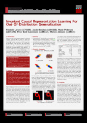

# Repository for Causal Representation Learning For Out-Of-Distribution Generalization

## About this repo
This repository was a part of the final hand-in for course no. 02456 - Deep Learning at the Technical University of Denmark. 

We attempt to recreate the results of 
[Lu et al 2022](https://openreview.net/pdf?id=-e4EXDWXnSn) in which they have created and implemented the iCaRL algorithm to gurantee out-of-distribution generalization. 


## Short comments on the imlpementation
- Implemented a fairly good NF-iVAE for synthetic data
- The PC algorithm yielded inconsistent results
- Comparing results from CMNIST we are not able to gurantee that our classification were based on causal parents of **Y**. As a consequence of the pc-algorithm not being stable. 

## Requirements
In order to run the jupyter notebooks you must install the following packages 
- Seaborn
- Matplotlib
- Scikit-image
- Scikit-learn
- Pytorch
- Numpy

These packages can be installed either via git | pip.

We recommend setting up a virtual enviroment - Read more [here](https://docs.python.org/3/tutorial/venv.html)

> The classification of CMNIST is computationally heavy - thus we recommend training with a GPU. The requirements installer install pytorch cuda.

For automaticly installing the required packages please enter the following in a terminal:
```
$ pip install -r requirements.txt
```

## R packages 
The PC algorithm works from R - Requirering additional packages. 
More can be found [here](https://cran.r-project.org/web/packages/pcalg/index.html)
> we recommend installing BioCManager to install plugins for R to work with the pcalg package. 


## Additional info
### Authors
- Morten Johnsen (s184334)
- Peter Emil Carstensen (s174332)
- Jacob Bendsen (s184328)
- Marie Pedersen (s174329)
- Frederik Larsen (s174159)


### Poster Session
We have uploaded the poster from the poster session. It can be found [here](https://openreview.net/pdf?id=-e4EXDWXnSn)

